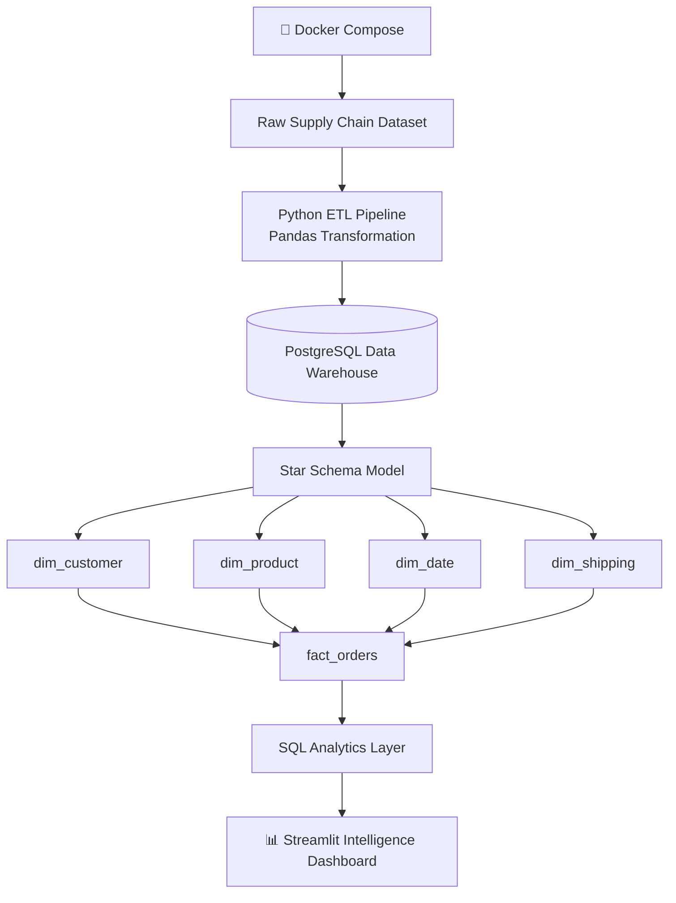
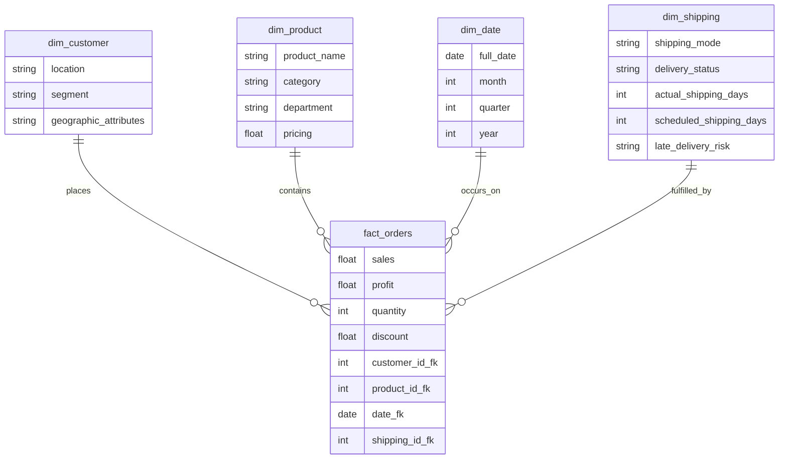
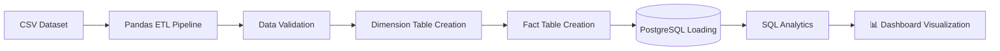
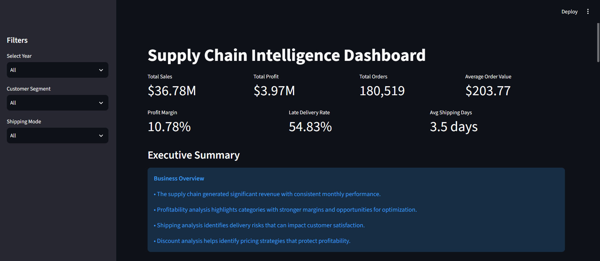
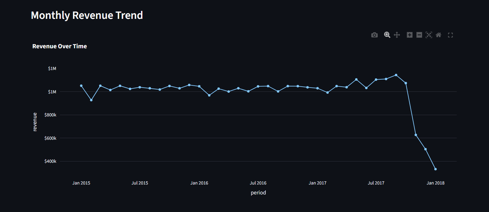
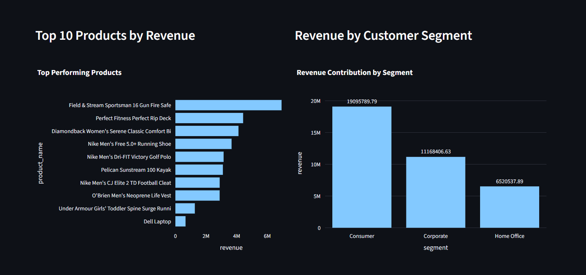
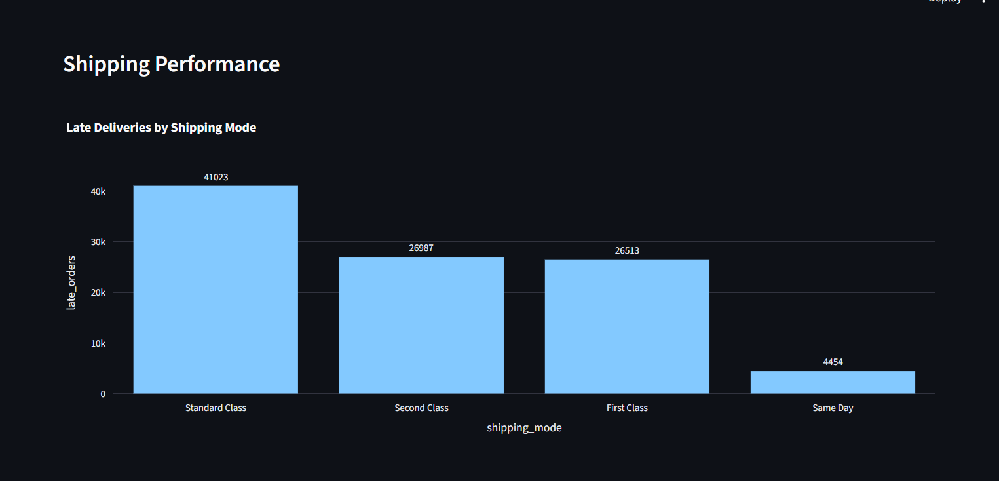
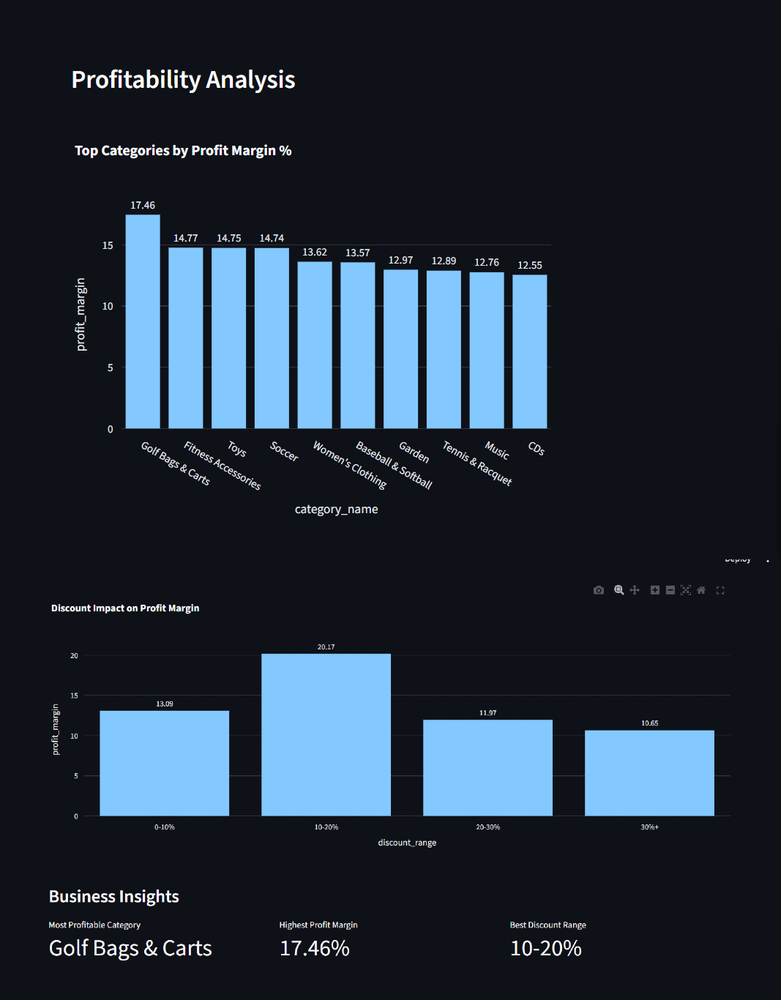

<div align="center">

# 🚚 Supply Chain Intelligence Platform

**A containerized, end-to-end analytics engineering platform that turns raw supply chain transactions into actionable business intelligence.**

Built with **Python · PostgreSQL · SQL · Streamlit · Docker**

[](https://www.python.org/)
[](https://www.postgresql.org/)
[](https://streamlit.io/)
[](https://www.docker.com/)
[](#)

</div>

---

## 📖 Table of Contents

- [Business Problem](#-business-problem)
- [Project Objectives](#-project-objectives)
- [System Architecture](#️-system-architecture)
- [Features](#-features)
- [Database Architecture](#️-database-architecture)
- [Repository Structure](#-repository-structure)
- [Dataset Overview](#-dataset-overview)
- [Technology Stack](#️-technology-stack)
- [Key Business KPIs](#-key-business-kpis)
- [Key Business Insights](#-key-business-insights)
- [Running with Docker](#-running-the-application-with-docker)
- [Data Pipeline Workflow](#-data-pipeline-workflow)
- [Future Improvements](#-future-improvements)
- [Author](#-author)

---

## 📌 Business Problem

Large-scale supply chain operations generate massive amounts of transactional data. Without proper analytics infrastructure, organizations struggle to answer important business questions:

- Which products generate the highest revenue?
- Which categories are the most profitable?
- Which customer segments contribute the most value?
- How do discounts impact profitability?
- Where are shipping delays occurring?
- What operational areas require optimization?

This project builds an analytics platform that converts raw operational data into meaningful insights for strategic and operational decision-making.

---

## 🎯 Project Objectives

| # | Objective |
|---|---|
| 1 | Build a reliable data processing pipeline |
| 2 | Clean and transform raw supply chain data |
| 3 | Design a relational analytical database |
| 4 | Implement a star schema data warehouse |
| 5 | Create reusable SQL analytics queries |
| 6 | Develop an interactive business intelligence dashboard |
| 7 | Containerize the complete application using Docker |

---

## 🏗️ System Architecture



---

## 🚀 Features

### 🔧 Data Engineering
- Automated ETL pipeline
- Data cleaning and transformation
- Duplicate handling
- Data validation checks
- Star schema implementation
- PostgreSQL data warehouse

### 📐 Analytics Engineering
- SQL-based KPI calculations
- Revenue analysis
- Profitability analysis
- Product performance analysis
- Customer segmentation analysis
- Shipping performance analysis
- Discount impact analysis

### 📊 Dashboard
Interactive Streamlit dashboard containing:

- Executive KPI overview
- Revenue trends
- Product performance analysis
- Customer segment analysis
- Shipping analytics
- Profitability insights
- Discount optimization analysis
- Dynamic filtering by **Year**, **Customer Segment**, and **Shipping Mode**

---

## 🗄️ Database Architecture

The project uses a **PostgreSQL star schema** design.



### Fact Table

**`fact_orders`** — stores transactional order-level information:
- Sales, Profit, Quantity, Discount
- Customer, Product, Date, and Shipping references

### Dimension Tables

| Table | Description |
|---|---|
| **`dim_customer`** | Customer location, segment, and geographic attributes |
| **`dim_product`** | Product name, category, department, and pricing |
| **`dim_date`** | Date, month, quarter, and year for time-based analysis |
| **`dim_shipping`** | Shipping mode, delivery status, actual vs. scheduled shipping days, and late delivery risk |

---

## 📂 Repository Structure

```
Supply-Chain-Intelligence
│
├── dashboard
│   ├── app.py
│   ├── database.py
│   └── queries.py
│
├── database
│   ├── schema.sql
│   └── analytics_queries.sql
│
├── data
│   ├── raw
│   ├── processed
│   └── analytics
│
├── notebooks
│   ├── 01_data_understanding.ipynb
│   ├── 02_data_cleaning.ipynb
│   └── 03_exploratory_data_analysis.ipynb
│
├── scripts
│   └── load_database.py
│
├── Dockerfile
├── docker-compose.yml
├── requirements.txt
├── .env
└── README.md
```

---

## 📊 Dataset Overview

The dataset contains historical supply chain transactions including orders, customers, products, sales, profit, discounts, shipping information, delivery information, and geographic attributes.

<div align="center">

| Metric | Value |
|---|---|
| **Rows (cleaned)** | 180,519 |
| **Analysis Period** | January 2015 – January 2018 |

</div>

---

## 🛠️ Technology Stack

<div align="center">

| Category | Technologies |
|---|---|
| **Programming** | Python |
| **Data Processing** | Pandas, NumPy |
| **Database** | PostgreSQL, SQLAlchemy |
| **Visualization** | Streamlit, Plotly, Matplotlib, Seaborn |
| **Development** | Jupyter Notebook, VS Code |
| **Deployment** | Docker, Docker Compose |
| **Version Control** | Git, GitHub |

</div>

---

## 📈 Key Business KPIs

| KPI | Description |
|---|---|
| **Total Sales** | Overall revenue generated |
| **Total Profit** | Profit generated from sales |
| **Total Orders** | Number of transactions |
| **Average Order Value** | Revenue per order |
| **Profit Margin** | Profitability percentage |
| **Late Delivery Rate** | Operational delivery risk |
| **Average Shipping Days** | Shipping efficiency |

---

## 💡 Key Business Insights

<table>
<tr>
<td width="50%" valign="top">

### 📦 Product Performance
- Revenue contribution is concentrated among top-performing products
- Product-level profitability varies significantly
- Certain products generate strong sales but weaker margins

</td>
<td width="50%" valign="top">

### 👥 Customer Segment Analysis
Customer segmentation helps identify:
- Highest revenue-generating customer groups
- Segment profitability
- Customer contribution patterns

</td>
</tr>
<tr>
<td width="50%" valign="top">

### 🚢 Shipping Performance
Shipping analysis identifies:
- Delivery risk patterns
- Shipping mode performance differences
- Operational improvement opportunities

</td>
<td width="50%" valign="top">

### 💸 Discount Analysis
Discount analysis evaluates:
- Relationship between discounts and profitability
- Pricing strategy effectiveness
- Margin protection opportunities

</td>
</tr>
</table>

---

## 🐳 Running the Application with Docker

### Prerequisites

- [Docker Desktop](https://www.docker.com/products/docker-desktop/)
- Docker Compose

### 1️⃣ Clone the Repository

```bash
git clone https://github.com/vedantdotpy/Supply-Chain-Intelligence.git
cd Supply-Chain-Intelligence
```

### 2️⃣ Configure Environment Variables

Create a `.env` file in the project root:

```env
POSTGRES_HOST=postgres
POSTGRES_PORT=5432
POSTGRES_DB=supply_chain_db
POSTGRES_USER=postgres
POSTGRES_PASSWORD=your_password
```

### 3️⃣ Start the Application

```bash
docker compose up --build
```

The system automatically starts:

1. 🐘 PostgreSQL database container
2. 📥 Data loader container
3. 📊 Streamlit dashboard container

The dashboard will be available at:

```
http://localhost:8501
```

---

## 🔄 Data Pipeline Workflow



---

# 📸 Dashboard Preview

## Executive Overview

The dashboard provides an executive-level view of supply chain performance including revenue, profitability, order volume, delivery risks, and operational KPIs.




---

## Revenue Performance

Monthly revenue trends help identify seasonal patterns and overall business performance over time.




---

## Product & Customer Analytics

Product contribution and customer segment analysis highlight revenue drivers and customer value distribution.




---

## Shipping Analytics

Shipping performance analysis identifies delivery risks and operational efficiency opportunities.




---

## Profitability Insights

Profitability analysis evaluates category margins and discount strategies to support pricing decisions.



## 🔮 Future Improvements

- ☁️ Cloud deployment using AWS/Azure
- 🔁 CI/CD pipeline integration
- ✅ Automated data quality monitoring
- ⚡ Real-time data ingestion pipeline
- 📈 Sales forecasting models
- 🤖 Customer segmentation using machine learning
- 🚚 Delivery delay prediction model
- 🧠 Advanced supply chain optimization models

---

## 👨‍💻 Author

<div align="center">

**Vedant Mishra**

B.Tech — Industrial Internet of Things

Interested in **Data Analytics** · **Backend Engineering** · **Database Systems** · **Business Intelligence**

[](https://github.com/vedantdotpy)

</div>